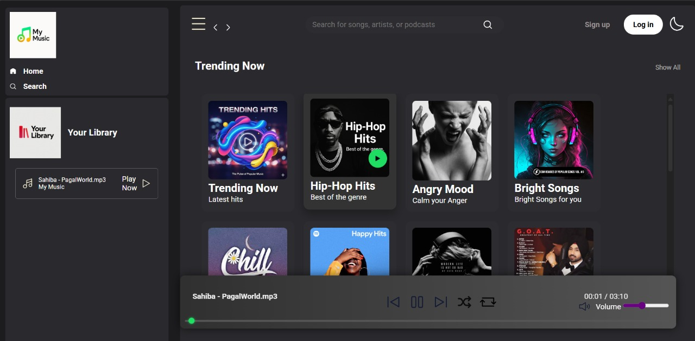
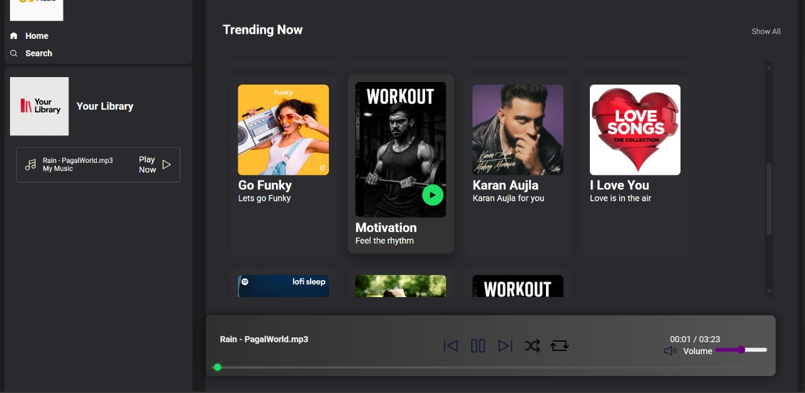

# My Music Player 🎵

A clean and elegant web-based music player designed for a seamless and immersive listening experience. It's a modern, front-end application built with core web technologies.

**🔴 Live Demo:** Coming Soon!

---

### 📸 Screenshots


| Desktop View | Mobile View |
| :---: | :---: |
|  |  |

---

### ✨ Key Features

* **Stylish UI:** A modern, visually appealing dark theme that's easy on the eyes.
* **Dynamic Playlists:** Easily load and manage different playlists from local folders.
* **Interactive Player Controls:** Intuitive buttons for play, pause, next, previous, shuffle, and repeat.
* **Live Seekbar:** A responsive seekbar that updates in real-time as the song plays.
* **Interactive Elements:** Smooth hover effects and subtle click feedback on cards and buttons for a better user experience.
* **Sticky Navbar:** The top navigation bar stays fixed at the top of the page, keeping the search bar and login buttons always accessible.
* **Smooth Scrolling:** A fluid and smooth scrolling experience throughout the web player.
* **Responsive Design:** The layout automatically adjusts to look great on both desktop and mobile devices.

---

### 🛠️ Technology Stack

* **Frontend:** HTML5, CSS3, JavaScript (ES6+)
* **APIs:** None. (This is a local player)
* **Libraries:** None.

---

### 🚀 Getting Started

To get a local copy up and running, follow these simple steps.

1.  **Clone the Repository:**
    ```bash
    git clone [https://github.com/Jatin2004-code/My-Music-Player.git](https://github.com/Jatin2004-code/My-Music-Player.git)
    ```
2.  **Navigate to the Project Directory:**
    ```bash
    cd My-Music-Web-Player
    ```
3.  **Open in Browser:**
    * Simply open the `index.html` file in your favorite web browser to see the project in action!

---

### 🤝 Connect with Me

Feel free to reach out if you have any questions or suggestions!

<p align="left">
    <a href="https://www.linkedin.com/in/jatin-kanojiya-72a11331b/" target="_blank"></a>
    <a href="https://github.com/Jatin2004-code" target="_blank"></a>
</p>